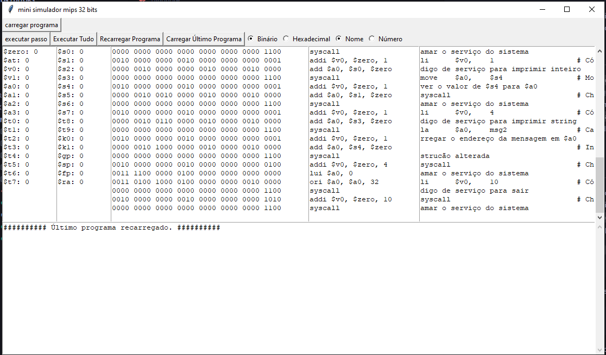

# Mini Simulador MIPS 32 Bits

## Descrição
Comecei este projeto achando que era algo muito mais complicado, então tem coisas meio tortas, mas no final tudo funciona. Inicialmente, achei que era para fazer o simulador de maneira mais fiel ao datapath possível, então comecei criando os "módulos" do datapath. Deu muito trabalho para fazer funcionar igualzinho, então foquei em fazer funcionar, e está funcionando legal. Poderia ter sido feito de maneira mais fácil de entender e mais simples, mas quis deixar do jeito que estava começando a fazer.

Os arquivos dentro da pasta `datapath` não fazem nada relevante, mas simulam de forma simplificada como funcionaria no MIPS.

Coloquei a forma binária e hexadecimal para ficar mais fácil de comparar com outros simuladores, os registradores também.

## Estrutura do Projeto
A principal parte está dentro do `src`, onde acontece a simulação. Na pasta `gui` tem o arquivo da interface, e no `data` tem o arquivo que gera para ficar mais fácil de carregar o programa. Dentro do `src` tem o `datapath` que, como disse antes, "simula" de forma simplificada como o MIPS funciona, mas não está nem 30% pronto.

## Requisitos
Ter o Python instalado, minha versão é 3.12.4, mas deve rodar com qualquer versão acima de 3, e instalar a biblioteca `tkinter`. Instalei também a biblioteca `watchdog` para que, toda vez que eu modificar um arquivo, ele recompile tudo.

Tem o arquivo `requirements.txt` para facilitar a instalação. Os comandos são:
```sh
pip install -r requirements.txt
```
Ou:
```sh
pip install tkinter watchdog
```

## Como Usar
Execute o comando:
```sh
python main.py
```

## Exemplos
Clique em carregar o arquivo e escolha se quer executar de uma vez ou em passos. Se clicar em passos e depois em executar tudo, vai rodar de onde você parou.

Tem o recarregamento automatico do ultimo programa pra facilitar na hora de testar.

Foto da interface:

